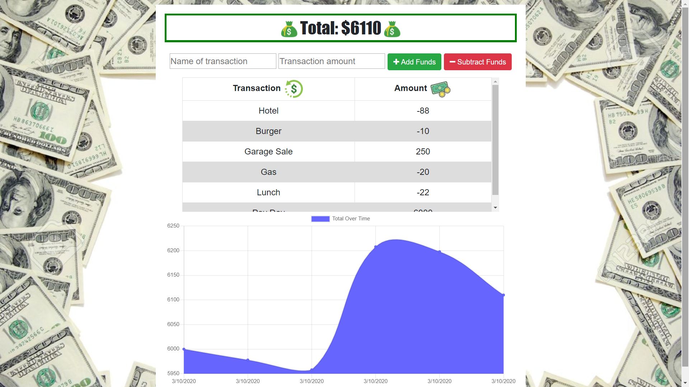

# Budget-Tracker
Able to add expenses and deposits to their budget with or without a connection using service workers/PWA and indexedDB. When entering transactions offline, they should populate the total when brought back online.

## Getting Started

These instructions will get you a copy of the project up and running on your local machine for development and testing purposes

### Prerequisites

-Mongoose/Mongodb
-Express
-Morgan
-Compression
-lite-server
-NodeJS

### Installing

-Clone or fork repo & have mongodb running 
-Go to repo directory
-Run: npm install
-Run: npm start
-Go to localhost:3000

## Deployment

Or you can view and try the app here: https://moolahtracker.herokuapp.com/

## Built With

Visual Studio Code & MongoDB/Robo-3T

## Authors

* **Anil Burak Canbolat** - https://github.com/Anil1992-rgb

## License

This project is licensed under the MIT License - see the [LICENSE.md](LICENSE) file for details

## Acknowledgments

* University of Oregon Coding Bootcamp